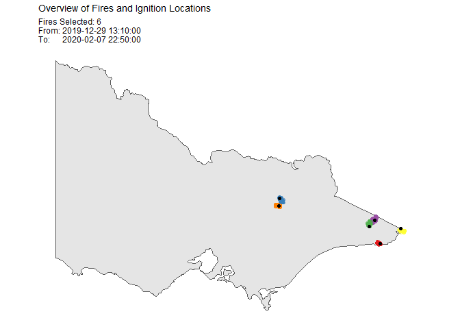
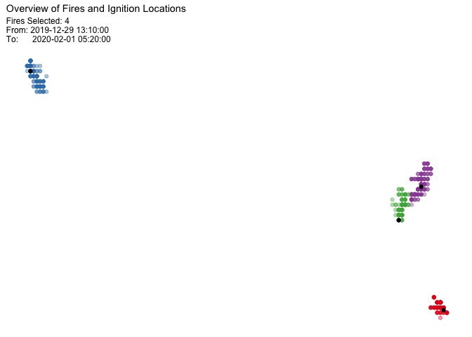
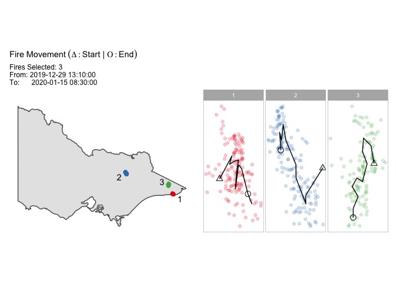
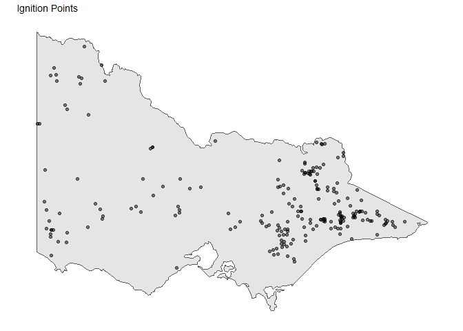

<!-- README.md is generated from README.Rmd. Please edit that file -->

# spotoroo

<!-- badges: start -->

[](https://github.com/TengMCing/spotoroo/actions)
[](https://codecov.io/gh/TengMCing/spotoroo?branch=master)
<!-- badges: end -->

## Overview

“spotoroo” stands for spatiotemporal clustering in R of hot spot data.
It is an algorithm to cluster satellite hot spots, detect ignition
points and reconstruct fire movement.

## Installation

You can install the released version of spotoroo from
[CRAN](https://CRAN.R-project.org) with:

``` r
install.packages("spotoroo")
```

You can install the development version from GitHub with:

``` r
# install.packages("devtools")
devtools::install_github("TengMCing/spotoroo")
```

## Usage

``` r
library(spotoroo)
```

The below examples use the built-in dataset `hotspots`. The hot spot
data needs to has at least three columns: the longitude, the latitude,
and the observed time.

``` r
str(hotspots)
#> 'data.frame':    1070 obs. of  3 variables:
#>  $ lon    : num  147 146 143 149 142 ...
#>  $ lat    : num  -37.5 -37.9 -37.8 -37.4 -37.1 ...
#>  $ obsTime: POSIXct, format: "2020-02-01 05:20:00" "2020-01-02 06:30:00" ...
```

Perform spatiotemporal clustering on this dataset. You need to specify
which columns correspond to the spatial variables (“lon”, “lat”), and
which to observed time (“obsTime”).

There is a choice of options for the algorithm.

-   “activeTime” sets the time to consider that a fire can be active,
    and longer than this between hot spots will create a new cluster

-   “adjDist” sets the maximum intra-cluster spatial distance between
    nearest hot spots beyond which they would be considered part of a
    different cluster

-   “minPts” sets the minimum number of hot spots in a cluster

-   “minTime” sets the minimum length of time of a cluster

-   “ignitionCenter” sets the method to calculate the ignition points

-   “timeUnit” and “timeStep” set the length of time between successive
    time indexes

``` r
result <- hotspot_cluster(hotspots,
                          lon = "lon",
                          lat = "lat",
                          obsTime = "obsTime",
                          activeTime = 24,
                          adjDist = 3000,
                          minPts = 4,
                          minTime = 3,
                          ignitionCenter = "mean",
                          timeUnit = "h",
                          timeStep = 1)
#> 
#> ──────────────────────────────── SPOTOROO 0.1.2 ────────────────────────────────
#> 
#> ── Calling Core Function : `hotspot_cluster()` ──
#> 
#> ── '1' time index = 1 hours
#> ✓ Transform observed time → time indexes
#> ℹ 970 time indexes found
#> 
#> ── activeTime = 24 time indexes | adjDist = 3000 meters
#> ✓ Cluster
#> ℹ 16 clusters found (including noise)
#> 
#> ── minPts = 4 hot spots | minTime = 3 time indexes
#> ✓ Handle noise
#> ℹ 6 clusters left
#> ℹ noise proportion : '0.935 %'
#> 
#> ── ignitionCenter = 'mean'
#> ✓ Compute ignition points for clusters
#> ℹ average hot spots : 176.7
#> ℹ average duration : 131.9 hours
#> 
#> ── Time taken = 0 mins 1 sec for 1070 hot spots
#> ℹ 0.001 secs per hot spot
#> 
#> ────────────────────────────────────────────────────────────────────────────────


result
#> ℹ spotoroo object: 6 clusters | 1070 hot spots (including noise points)
```

You can make a summary of the clustering results.

``` r
summary(result)
#> 
#> ──────────────────────────────── SPOTOROO 0.1.2 ────────────────────────────────
#> 
#> ── Calling Core Function : `summary_spotoroo()` ──
#> 
#> CLUSTERS: ALL
#> OBSERVATIONS: 1070
#> FROM: 2019-12-29 13:10:00
#> TO:   2020-02-07 22:50:00
#> 
#> ── Clusters
#> ℹ Number of clusters: 6
#> 
#> Observations in cluster
#>         Min.     1st Qu.        Mean     3rd Qu.        Max.
#>        111.0       131.0       176.7       233.2       256.0
#> Duration of cluster (hours)
#>         Min.     1st Qu.        Mean     3rd Qu.        Max.
#>        111.2       118.2       131.9       146.1       148.3
#> 
#> ── Hot spots (excluding noise)
#> ℹ Number of hot spots: 1060
#> 
#> Distance to ignition points (m)
#>         Min.     1st Qu.        Mean     3rd Qu.        Max.
#>          0.0      2840.3      5058.2      6981.6     13452.7
#> Time from ignition (hours)
#>         Min.     1st Qu.        Mean     3rd Qu.        Max.
#>          0.0        25.2        62.5        98.2       148.3
#> 
#> ── Noise
#> ℹ Number of noise points: 10 ('0.93 %')
#> 
#> ────────────────────────────────────────────────────────────────────────────────
```

You can extract a subset of clusters from the results.

``` r
fire_1_and_2 <- extract_fire(result, 1:2)
head(fire_1_and_2, 2)
#>     lon       lat             obsTime timeID membership noise distToIgnition
#> 1 149.3 -37.75999 2019-12-29 13:10:00      1          1 FALSE       1111.885
#> 2 149.3 -37.78000 2019-12-29 13:10:00      1          1 FALSE       1111.885
#>   distToIgnitionUnit timeFromIgnition timeFromIgnitionUnit    type obsInCluster
#> 1                  m          0 hours                    h hotspot          146
#> 2                  m          0 hours                    h hotspot          146
#>   clusterTimeLen clusterTimeLenUnit
#> 1 116.1667 hours                  h
#> 2 116.1667 hours                  h
```

Plot of the result. In this example, there is a total of 6 clusters, so
all can be displayed.

``` r
plot(result, bg = plot_vic_map())
```



You can also choose a subset of clusters, and this will plot without a
map, so that you can see a zoomed in view of the hot spot clusters and
their ignition points.

``` r
plot(result, cluster = c(1,2,3,4))
```



To examine the fire movements, use the option “mov”, and the movement
will be shown as connected lines between centroids at each time step,
for each cluster.

``` r
plot(result,
   type = "mov",
   cluster = 1:3,
   step = 6,
   bg = plot_vic_map())
```



To examine the time line of clusters and learn about the intensity of
fire periods, use the option “timeline”.

``` r
plot(result, "timeline", 
     dateLabel = "%b %d", 
     mainBreak = "1 week")
```


