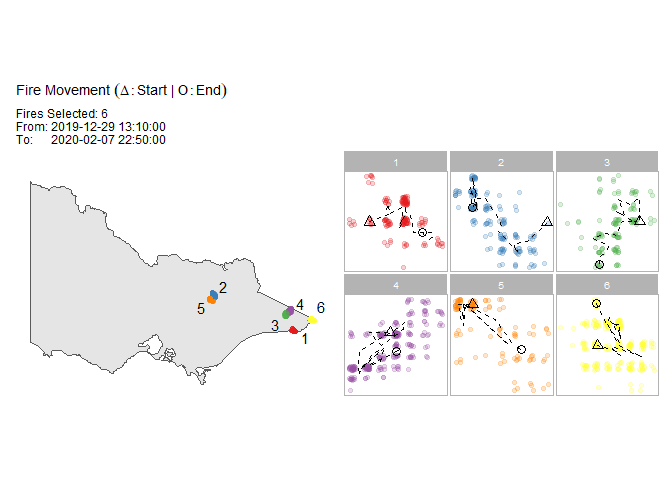

<!-- README.md is generated from README.Rmd. Please edit that file -->

# spotoroo

<!-- badges: start -->

[](https://github.com/TengMCing/spotoroo/actions)
<!-- badges: end -->

The goal of spotoroo is to …

## Installation

<!-- You can install the released version of spotoroo from [CRAN](https://CRAN.R-project.org) with: -->

<!-- ``` r -->

<!-- install.packages("spotoroo") -->

<!-- ``` -->

You can install the development version from
[GitHub](https://github.com/) with:

``` r
install.packages("devtools")
devtools::install_github("TengMCing/spotoroo")
```

## Example

This is a basic example which shows you how to solve a common problem:

``` r
library(spotoroo)
```

The built-in dataset `hotspots_fin`.

``` r
str(hotspots_fin)
#> 'data.frame':    1070 obs. of  3 variables:
#>  $ lon    : num  147 146 143 149 142 ...
#>  $ lat    : num  -37.5 -37.9 -37.8 -37.4 -37.1 ...
#>  $ obsTime: POSIXct, format: "2020-02-01 05:20:00" ...
```

``` r
hotspots_fin[1:10,]
#>       lon       lat             obsTime
#> 1  147.46 -37.46000 2020-02-01 05:20:00
#> 2  146.48 -37.93999 2020-01-02 06:30:00
#> 3  143.44 -37.82000 2020-01-03 07:20:00
#> 4  149.30 -37.36000 2020-01-22 05:10:00
#> 5  142.14 -37.06000 2020-01-18 06:40:00
#> 6  142.16 -37.50000 2020-01-03 05:40:00
#> 7  149.42 -37.34000 2020-01-26 04:40:00
#> 8  147.68 -36.62000 2020-01-04 05:10:00
#> 9  148.48 -37.40000 2020-01-15 05:20:00
#> 10 148.04 -36.38000 2020-01-12 08:50:00
```

``` r
library(tidyverse)
vic_map +
  geom_point(data = hotspots_fin, aes(lon, lat), alpha = 0.3) +
  ggtitle("Raw Hotspots")
```


Perform spatiotemporal clustering on this dataset. You need to provide
the data, here it is “hotspots\_fin”, specify which columns correspond
to the spatial variables (lon, lat), and which to time steps (obsTime).
There is a choice of options for the algorithm. “activeTime” sets the
time to consider that a fire can be active, and longer than this between
hotspots will create a new cluster. “adjDist” sets the maximum spatial
distance between hotspots beyond which they would be considered part of
a different cluster.

``` r
result <- hotspot_cluster(hotspots_fin,
                          lon = "lon",
                          lat = "lat",
                          obsTime = "obsTime",
                          activeTime = 24,
                          adjDist = 3000,
                          minPts = 4,
                          minTime = 3,
                          ignitionCenter = "mean",
                          timeUnit = "h",
                          timeStep = 1)
#> 
#> ------------------------- SPOTOROO 0.0.0.9000 -------------------------
#> 
#> -- Calling Core Function : `hotspot_cluster()` --
#> 
#> -- 1 time index = 1 hours
#> v Transform observed time > time indexes
#> i 970 time indexes found
#> 
#> -- activeTime = 24 time indexes | adjDist = 3000 meters
#> Clustering [==>------------------------------] 98/970 ( 10%) eta:  2sClustering [==>------------------------------] 99/970 ( 10%) eta:  2sClustering [==>-----------------------------] 100/970 ( 10%) eta:  2sClustering [==>-----------------------------] 101/970 ( 10%) eta:  2sClustering [==>-----------------------------] 102/970 ( 11%) eta:  2sClustering [==>-----------------------------] 103/970 ( 11%) eta:  2sClustering [==>-----------------------------] 104/970 ( 11%) eta:  2sClustering [==>-----------------------------] 105/970 ( 11%) eta:  2sClustering [==>-----------------------------] 106/970 ( 11%) eta:  2sClustering [===>----------------------------] 107/970 ( 11%) eta:  2sClustering [===>----------------------------] 108/970 ( 11%) eta:  2sClustering [===>----------------------------] 109/970 ( 11%) eta:  2sClustering [===>----------------------------] 110/970 ( 11%) eta:  2sClustering [===>----------------------------] 111/970 ( 11%) eta:  2sClustering [===>----------------------------] 112/970 ( 12%) eta:  2sClustering [===>----------------------------] 113/970 ( 12%) eta:  2sClustering [===>----------------------------] 114/970 ( 12%) eta:  2sClustering [===>----------------------------] 115/970 ( 12%) eta:  2sClustering [===>----------------------------] 116/970 ( 12%) eta:  2sClustering [===>----------------------------] 117/970 ( 12%) eta:  2sClustering [===>----------------------------] 118/970 ( 12%) eta:  2sClustering [===>----------------------------] 119/970 ( 12%) eta:  2sClustering [===>----------------------------] 120/970 ( 12%) eta:  2sClustering [===>----------------------------] 121/970 ( 12%) eta:  2sClustering [===>----------------------------] 122/970 ( 13%) eta:  2sClustering [===>----------------------------] 123/970 ( 13%) eta:  2sClustering [===>----------------------------] 124/970 ( 13%) eta:  2sClustering [===>----------------------------] 125/970 ( 13%) eta:  2sClustering [===>----------------------------] 126/970 ( 13%) eta:  2sClustering [===>----------------------------] 127/970 ( 13%) eta:  2sClustering [===>----------------------------] 128/970 ( 13%) eta:  2sClustering [===>----------------------------] 129/970 ( 13%) eta:  2sClustering [===>----------------------------] 130/970 ( 13%) eta:  2sClustering [===>----------------------------] 131/970 ( 14%) eta:  2sClustering [===>----------------------------] 132/970 ( 14%) eta:  2sClustering [===>----------------------------] 133/970 ( 14%) eta:  2sClustering [===>----------------------------] 134/970 ( 14%) eta:  2sClustering [===>----------------------------] 135/970 ( 14%) eta:  2sClustering [===>----------------------------] 136/970 ( 14%) eta:  2sClustering [====>---------------------------] 137/970 ( 14%) eta:  2sClustering [====>---------------------------] 138/970 ( 14%) eta:  2sClustering [====>---------------------------] 139/970 ( 14%) eta:  2sClustering [====>---------------------------] 140/970 ( 14%) eta:  2sClustering [====>---------------------------] 141/970 ( 15%) eta:  2sClustering [====>---------------------------] 142/970 ( 15%) eta:  2sClustering [====>---------------------------] 143/970 ( 15%) eta:  2sClustering [====>---------------------------] 144/970 ( 15%) eta:  2sClustering [====>---------------------------] 145/970 ( 15%) eta:  2sClustering [====>---------------------------] 146/970 ( 15%) eta:  2sClustering [====>---------------------------] 147/970 ( 15%) eta:  2sClustering [====>---------------------------] 148/970 ( 15%) eta:  2sClustering [====>---------------------------] 149/970 ( 15%) eta:  2sClustering [====>---------------------------] 150/970 ( 15%) eta:  2sClustering [====>---------------------------] 151/970 ( 16%) eta:  2sClustering [====>---------------------------] 152/970 ( 16%) eta:  2sClustering [====>---------------------------] 153/970 ( 16%) eta:  2sClustering [====>---------------------------] 154/970 ( 16%) eta:  2sClustering [====>---------------------------] 155/970 ( 16%) eta:  2sClustering [====>---------------------------] 156/970 ( 16%) eta:  2sClustering [====>---------------------------] 157/970 ( 16%) eta:  2sClustering [====>---------------------------] 158/970 ( 16%) eta:  2sClustering [====>---------------------------] 159/970 ( 16%) eta:  2sClustering [====>---------------------------] 160/970 ( 16%) eta:  2sClustering [====>---------------------------] 161/970 ( 17%) eta:  2sClustering [====>---------------------------] 162/970 ( 17%) eta:  2sClustering [====>---------------------------] 163/970 ( 17%) eta:  2sClustering [====>---------------------------] 164/970 ( 17%) eta:  2sClustering [====>---------------------------] 165/970 ( 17%) eta:  2sClustering [====>---------------------------] 166/970 ( 17%) eta:  2sClustering [=====>--------------------------] 167/970 ( 17%) eta:  2sClustering [=====>--------------------------] 168/970 ( 17%) eta:  2sClustering [=====>--------------------------] 169/970 ( 17%) eta:  2sClustering [=====>--------------------------] 170/970 ( 18%) eta:  2sClustering [=====>--------------------------] 171/970 ( 18%) eta:  2sClustering [=====>--------------------------] 172/970 ( 18%) eta:  2sClustering [=====>--------------------------] 173/970 ( 18%) eta:  2sClustering [=====>--------------------------] 174/970 ( 18%) eta:  2sClustering [=====>--------------------------] 175/970 ( 18%) eta:  2sClustering [=====>--------------------------] 176/970 ( 18%) eta:  2sClustering [=====>--------------------------] 177/970 ( 18%) eta:  2sClustering [=====>--------------------------] 178/970 ( 18%) eta:  2sClustering [=====>--------------------------] 179/970 ( 18%) eta:  2sClustering [=====>--------------------------] 180/970 ( 19%) eta:  2sClustering [=====>--------------------------] 181/970 ( 19%) eta:  2sClustering [=====>--------------------------] 182/970 ( 19%) eta:  2sClustering [=====>--------------------------] 183/970 ( 19%) eta:  2sClustering [=====>--------------------------] 184/970 ( 19%) eta:  2sClustering [=====>--------------------------] 185/970 ( 19%) eta:  2sClustering [=====>--------------------------] 186/970 ( 19%) eta:  2sClustering [=====>--------------------------] 187/970 ( 19%) eta:  2sClustering [=====>--------------------------] 188/970 ( 19%) eta:  2sClustering [=====>--------------------------] 189/970 ( 19%) eta:  2sClustering [=====>--------------------------] 190/970 ( 20%) eta:  2sClustering [=====>--------------------------] 191/970 ( 20%) eta:  2sClustering [=====>--------------------------] 192/970 ( 20%) eta:  2sClustering [=====>--------------------------] 193/970 ( 20%) eta:  2sClustering [=====>--------------------------] 194/970 ( 20%) eta:  2sClustering [=====>--------------------------] 195/970 ( 20%) eta:  2sClustering [=====>--------------------------] 196/970 ( 20%) eta:  2sClustering [=====>--------------------------] 197/970 ( 20%) eta:  2sClustering [======>-------------------------] 198/970 ( 20%) eta:  2sClustering [======>-------------------------] 199/970 ( 21%) eta:  2sClustering [======>-------------------------] 200/970 ( 21%) eta:  2sClustering [======>-------------------------] 201/970 ( 21%) eta:  2sClustering [======>-------------------------] 202/970 ( 21%) eta:  2sClustering [======>-------------------------] 203/970 ( 21%) eta:  2sClustering [======>-------------------------] 204/970 ( 21%) eta:  2sClustering [======>-------------------------] 205/970 ( 21%) eta:  2sClustering [======>-------------------------] 206/970 ( 21%) eta:  2sClustering [======>-------------------------] 207/970 ( 21%) eta:  2sClustering [======>-------------------------] 208/970 ( 21%) eta:  2sClustering [======>-------------------------] 209/970 ( 22%) eta:  2sClustering [======>-------------------------] 210/970 ( 22%) eta:  2sClustering [======>-------------------------] 211/970 ( 22%) eta:  2sClustering [======>-------------------------] 212/970 ( 22%) eta:  2sClustering [======>-------------------------] 213/970 ( 22%) eta:  2sClustering [======>-------------------------] 214/970 ( 22%) eta:  2sClustering [======>-------------------------] 215/970 ( 22%) eta:  2sClustering [======>-------------------------] 216/970 ( 22%) eta:  2sClustering [======>-------------------------] 217/970 ( 22%) eta:  2sClustering [======>-------------------------] 218/970 ( 22%) eta:  2sClustering [======>-------------------------] 219/970 ( 23%) eta:  2sClustering [======>-------------------------] 220/970 ( 23%) eta:  2sClustering [======>-------------------------] 221/970 ( 23%) eta:  2sClustering [======>-------------------------] 222/970 ( 23%) eta:  2sClustering [======>-------------------------] 223/970 ( 23%) eta:  2sClustering [======>-------------------------] 224/970 ( 23%) eta:  2sClustering [======>-------------------------] 225/970 ( 23%) eta:  2sClustering [======>-------------------------] 226/970 ( 23%) eta:  2sClustering [======>-------------------------] 227/970 ( 23%) eta:  2sClustering [=======>------------------------] 228/970 ( 24%) eta:  2sClustering [=======>------------------------] 229/970 ( 24%) eta:  2sClustering [=======>------------------------] 230/970 ( 24%) eta:  2sClustering [=======>------------------------] 231/970 ( 24%) eta:  2sClustering [=======>------------------------] 232/970 ( 24%) eta:  2sClustering [=======>------------------------] 233/970 ( 24%) eta:  2sClustering [=======>------------------------] 234/970 ( 24%) eta:  2sClustering [=======>------------------------] 235/970 ( 24%) eta:  2sClustering [=======>------------------------] 236/970 ( 24%) eta:  2sClustering [=======>------------------------] 237/970 ( 24%) eta:  2sClustering [=======>------------------------] 238/970 ( 25%) eta:  2sClustering [=======>------------------------] 239/970 ( 25%) eta:  2sClustering [=======>------------------------] 240/970 ( 25%) eta:  2sClustering [=======>------------------------] 241/970 ( 25%) eta:  2sClustering [=======>------------------------] 242/970 ( 25%) eta:  2sClustering [=======>------------------------] 243/970 ( 25%) eta:  2sClustering [=======>------------------------] 244/970 ( 25%) eta:  2sClustering [=======>------------------------] 245/970 ( 25%) eta:  2sClustering [=======>------------------------] 246/970 ( 25%) eta:  2sClustering [=======>------------------------] 247/970 ( 25%) eta:  2sClustering [=======>------------------------] 248/970 ( 26%) eta:  2sClustering [=======>------------------------] 249/970 ( 26%) eta:  2sClustering [=======>------------------------] 250/970 ( 26%) eta:  2sClustering [=======>------------------------] 251/970 ( 26%) eta:  2sClustering [=======>------------------------] 252/970 ( 26%) eta:  2sClustering [=======>------------------------] 253/970 ( 26%) eta:  2sClustering [=======>------------------------] 254/970 ( 26%) eta:  2sClustering [=======>------------------------] 255/970 ( 26%) eta:  2sClustering [=======>------------------------] 256/970 ( 26%) eta:  2sClustering [=======>------------------------] 257/970 ( 26%) eta:  2sClustering [========>-----------------------] 258/970 ( 27%) eta:  2sClustering [========>-----------------------] 259/970 ( 27%) eta:  2sClustering [========>-----------------------] 260/970 ( 27%) eta:  2sClustering [========>-----------------------] 261/970 ( 27%) eta:  2sClustering [========>-----------------------] 262/970 ( 27%) eta:  2sClustering [========>-----------------------] 263/970 ( 27%) eta:  2sClustering [========>-----------------------] 264/970 ( 27%) eta:  2sClustering [========>-----------------------] 265/970 ( 27%) eta:  2sClustering [========>-----------------------] 266/970 ( 27%) eta:  2sClustering [========>-----------------------] 267/970 ( 28%) eta:  2sClustering [========>-----------------------] 268/970 ( 28%) eta:  2sClustering [========>-----------------------] 269/970 ( 28%) eta:  2sClustering [========>-----------------------] 270/970 ( 28%) eta:  2sClustering [========>-----------------------] 271/970 ( 28%) eta:  2sClustering [========>-----------------------] 272/970 ( 28%) eta:  2sClustering [========>-----------------------] 273/970 ( 28%) eta:  2sClustering [========>-----------------------] 274/970 ( 28%) eta:  2sClustering [========>-----------------------] 275/970 ( 28%) eta:  2sClustering [========>-----------------------] 276/970 ( 28%) eta:  2sClustering [========>-----------------------] 277/970 ( 29%) eta:  2sClustering [========>-----------------------] 278/970 ( 29%) eta:  2sClustering [========>-----------------------] 279/970 ( 29%) eta:  2sClustering [========>-----------------------] 280/970 ( 29%) eta:  2sClustering [========>-----------------------] 281/970 ( 29%) eta:  2sClustering [========>-----------------------] 282/970 ( 29%) eta:  2sClustering [========>-----------------------] 283/970 ( 29%) eta:  2sClustering [========>-----------------------] 284/970 ( 29%) eta:  2sClustering [========>-----------------------] 285/970 ( 29%) eta:  2sClustering [========>-----------------------] 286/970 ( 29%) eta:  2sClustering [========>-----------------------] 287/970 ( 30%) eta:  2sClustering [=========>----------------------] 288/970 ( 30%) eta:  2sClustering [=========>----------------------] 289/970 ( 30%) eta:  2sClustering [=========>----------------------] 290/970 ( 30%) eta:  2sClustering [=========>----------------------] 291/970 ( 30%) eta:  2sClustering [=========>----------------------] 292/970 ( 30%) eta:  2sClustering [=========>----------------------] 293/970 ( 30%) eta:  2sClustering [=========>----------------------] 294/970 ( 30%) eta:  2sClustering [=========>----------------------] 295/970 ( 30%) eta:  2sClustering [=========>----------------------] 296/970 ( 31%) eta:  2sClustering [=========>----------------------] 297/970 ( 31%) eta:  2sClustering [=========>----------------------] 298/970 ( 31%) eta:  2sClustering [=========>----------------------] 299/970 ( 31%) eta:  2sClustering [=========>----------------------] 300/970 ( 31%) eta:  2sClustering [=========>----------------------] 301/970 ( 31%) eta:  2sClustering [=========>----------------------] 302/970 ( 31%) eta:  2sClustering [=========>----------------------] 303/970 ( 31%) eta:  2sClustering [=========>----------------------] 304/970 ( 31%) eta:  2sClustering [=========>----------------------] 305/970 ( 31%) eta:  2sClustering [=========>----------------------] 306/970 ( 32%) eta:  2sClustering [=========>----------------------] 307/970 ( 32%) eta:  2sClustering [=========>----------------------] 308/970 ( 32%) eta:  2sClustering [=========>----------------------] 309/970 ( 32%) eta:  2sClustering [=========>----------------------] 310/970 ( 32%) eta:  2sClustering [=========>----------------------] 311/970 ( 32%) eta:  2sClustering [=========>----------------------] 312/970 ( 32%) eta:  2sClustering [=========>----------------------] 313/970 ( 32%) eta:  2sClustering [=========>----------------------] 314/970 ( 32%) eta:  2sClustering [=========>----------------------] 315/970 ( 32%) eta:  2sClustering [=========>----------------------] 316/970 ( 33%) eta:  2sClustering [=========>----------------------] 317/970 ( 33%) eta:  2sClustering [=========>----------------------] 318/970 ( 33%) eta:  2sClustering [==========>---------------------] 319/970 ( 33%) eta:  2sClustering [==========>---------------------] 320/970 ( 33%) eta:  2sClustering [==========>---------------------] 321/970 ( 33%) eta:  2sClustering [==========>---------------------] 322/970 ( 33%) eta:  2sClustering [==========>---------------------] 323/970 ( 33%) eta:  2sClustering [==========>---------------------] 324/970 ( 33%) eta:  2sClustering [==========>---------------------] 325/970 ( 34%) eta:  2sClustering [==========>---------------------] 326/970 ( 34%) eta:  2sClustering [==========>---------------------] 327/970 ( 34%) eta:  2sClustering [==========>---------------------] 328/970 ( 34%) eta:  2sClustering [==========>---------------------] 329/970 ( 34%) eta:  2sClustering [==========>---------------------] 330/970 ( 34%) eta:  3sClustering [==========>---------------------] 331/970 ( 34%) eta:  3sClustering [==========>---------------------] 332/970 ( 34%) eta:  3sClustering [==========>---------------------] 333/970 ( 34%) eta:  3sClustering [==========>---------------------] 334/970 ( 34%) eta:  3sClustering [==========>---------------------] 335/970 ( 35%) eta:  3sClustering [==========>---------------------] 336/970 ( 35%) eta:  3sClustering [==========>---------------------] 337/970 ( 35%) eta:  3sClustering [==========>---------------------] 338/970 ( 35%) eta:  3sClustering [==========>---------------------] 339/970 ( 35%) eta:  3sClustering [==========>---------------------] 340/970 ( 35%) eta:  3sClustering [==========>---------------------] 341/970 ( 35%) eta:  3sClustering [==========>---------------------] 342/970 ( 35%) eta:  3sClustering [==========>---------------------] 343/970 ( 35%) eta:  3sClustering [==========>---------------------] 344/970 ( 35%) eta:  3sClustering [==========>---------------------] 345/970 ( 36%) eta:  3sClustering [==========>---------------------] 346/970 ( 36%) eta:  3sClustering [==========>---------------------] 347/970 ( 36%) eta:  3sClustering [==========>---------------------] 348/970 ( 36%) eta:  3sClustering [===========>--------------------] 349/970 ( 36%) eta:  3sClustering [===========>--------------------] 350/970 ( 36%) eta:  3sClustering [===========>--------------------] 351/970 ( 36%) eta:  3sClustering [===========>--------------------] 352/970 ( 36%) eta:  3sClustering [===========>--------------------] 353/970 ( 36%) eta:  3sClustering [===========>--------------------] 354/970 ( 36%) eta:  3sClustering [===========>--------------------] 355/970 ( 37%) eta:  4sClustering [===========>--------------------] 356/970 ( 37%) eta:  4sClustering [===========>--------------------] 357/970 ( 37%) eta:  4sClustering [===========>--------------------] 358/970 ( 37%) eta:  4sClustering [===========>--------------------] 359/970 ( 37%) eta:  4sClustering [===========>--------------------] 360/970 ( 37%) eta:  4sClustering [===========>--------------------] 361/970 ( 37%) eta:  4sClustering [===========>--------------------] 362/970 ( 37%) eta:  4sClustering [===========>--------------------] 363/970 ( 37%) eta:  4sClustering [===========>--------------------] 364/970 ( 38%) eta:  4sClustering [===========>--------------------] 365/970 ( 38%) eta:  4sClustering [===========>--------------------] 366/970 ( 38%) eta:  4sClustering [===========>--------------------] 367/970 ( 38%) eta:  4sClustering [===========>--------------------] 368/970 ( 38%) eta:  4sClustering [===========>--------------------] 369/970 ( 38%) eta:  4sClustering [===========>--------------------] 370/970 ( 38%) eta:  4sClustering [===========>--------------------] 371/970 ( 38%) eta:  4sClustering [===========>--------------------] 372/970 ( 38%) eta:  4sClustering [===========>--------------------] 373/970 ( 38%) eta:  4sClustering [===========>--------------------] 374/970 ( 39%) eta:  4sClustering [===========>--------------------] 375/970 ( 39%) eta:  4sClustering [===========>--------------------] 376/970 ( 39%) eta:  4sClustering [===========>--------------------] 377/970 ( 39%) eta:  4sClustering [===========>--------------------] 378/970 ( 39%) eta:  4sClustering [============>-------------------] 379/970 ( 39%) eta:  4sClustering [============>-------------------] 380/970 ( 39%) eta:  4sClustering [============>-------------------] 381/970 ( 39%) eta:  4sClustering [============>-------------------] 382/970 ( 39%) eta:  4sClustering [============>-------------------] 383/970 ( 39%) eta:  4sClustering [============>-------------------] 384/970 ( 40%) eta:  4sClustering [============>-------------------] 385/970 ( 40%) eta:  4sClustering [============>-------------------] 386/970 ( 40%) eta:  4sClustering [============>-------------------] 387/970 ( 40%) eta:  4sClustering [============>-------------------] 388/970 ( 40%) eta:  4sClustering [============>-------------------] 389/970 ( 40%) eta:  4sClustering [============>-------------------] 390/970 ( 40%) eta:  4sClustering [============>-------------------] 391/970 ( 40%) eta:  4sClustering [============>-------------------] 392/970 ( 40%) eta:  4sClustering [============>-------------------] 393/970 ( 41%) eta:  4sClustering [============>-------------------] 394/970 ( 41%) eta:  4sClustering [============>-------------------] 395/970 ( 41%) eta:  4sClustering [============>-------------------] 396/970 ( 41%) eta:  4sClustering [============>-------------------] 397/970 ( 41%) eta:  4sClustering [============>-------------------] 398/970 ( 41%) eta:  4sClustering [============>-------------------] 399/970 ( 41%) eta:  4sClustering [============>-------------------] 400/970 ( 41%) eta:  4sClustering [============>-------------------] 401/970 ( 41%) eta:  4sClustering [============>-------------------] 402/970 ( 41%) eta:  4sClustering [============>-------------------] 403/970 ( 42%) eta:  4sClustering [============>-------------------] 404/970 ( 42%) eta:  4sClustering [============>-------------------] 405/970 ( 42%) eta:  4sClustering [============>-------------------] 406/970 ( 42%) eta:  4sClustering [============>-------------------] 407/970 ( 42%) eta:  4sClustering [============>-------------------] 408/970 ( 42%) eta:  4sClustering [============>-------------------] 409/970 ( 42%) eta:  4sClustering [=============>------------------] 410/970 ( 42%) eta:  4sClustering [=============>------------------] 411/970 ( 42%) eta:  4sClustering [=============>------------------] 412/970 ( 42%) eta:  4sClustering [=============>------------------] 413/970 ( 43%) eta:  4sClustering [=============>------------------] 414/970 ( 43%) eta:  4sClustering [=============>------------------] 415/970 ( 43%) eta:  4sClustering [=============>------------------] 416/970 ( 43%) eta:  4sClustering [=============>------------------] 417/970 ( 43%) eta:  4sClustering [=============>------------------] 418/970 ( 43%) eta:  4sClustering [=============>------------------] 419/970 ( 43%) eta:  4sClustering [=============>------------------] 420/970 ( 43%) eta:  4sClustering [=============>------------------] 421/970 ( 43%) eta:  4sClustering [=============>------------------] 422/970 ( 44%) eta:  4sClustering [=============>------------------] 423/970 ( 44%) eta:  4sClustering [=============>------------------] 424/970 ( 44%) eta:  4sClustering [=============>------------------] 425/970 ( 44%) eta:  4sClustering [=============>------------------] 426/970 ( 44%) eta:  4sClustering [=============>------------------] 427/970 ( 44%) eta:  4sClustering [=============>------------------] 428/970 ( 44%) eta:  4sClustering [=============>------------------] 429/970 ( 44%) eta:  4sClustering [=============>------------------] 430/970 ( 44%) eta:  4sClustering [=============>------------------] 431/970 ( 44%) eta:  4sClustering [=============>------------------] 432/970 ( 45%) eta:  4sClustering [=============>------------------] 433/970 ( 45%) eta:  4sClustering [=============>------------------] 434/970 ( 45%) eta:  4sClustering [=============>------------------] 435/970 ( 45%) eta:  4sClustering [=============>------------------] 436/970 ( 45%) eta:  4sClustering [=============>------------------] 437/970 ( 45%) eta:  4sClustering [=============>------------------] 438/970 ( 45%) eta:  4sClustering [=============>------------------] 439/970 ( 45%) eta:  4sClustering [==============>-----------------] 440/970 ( 45%) eta:  4sClustering [==============>-----------------] 441/970 ( 45%) eta:  4sClustering [==============>-----------------] 442/970 ( 46%) eta:  4sClustering [==============>-----------------] 443/970 ( 46%) eta:  4sClustering [==============>-----------------] 444/970 ( 46%) eta:  4sClustering [==============>-----------------] 445/970 ( 46%) eta:  4sClustering [==============>-----------------] 446/970 ( 46%) eta:  4sClustering [==============>-----------------] 447/970 ( 46%) eta:  4sClustering [==============>-----------------] 448/970 ( 46%) eta:  4sClustering [==============>-----------------] 449/970 ( 46%) eta:  4sClustering [==============>-----------------] 450/970 ( 46%) eta:  4sClustering [==============>-----------------] 451/970 ( 46%) eta:  4sClustering [==============>-----------------] 452/970 ( 47%) eta:  4sClustering [==============>-----------------] 453/970 ( 47%) eta:  4sClustering [==============>-----------------] 454/970 ( 47%) eta:  4sClustering [==============>-----------------] 455/970 ( 47%) eta:  4sClustering [==============>-----------------] 456/970 ( 47%) eta:  4sClustering [==============>-----------------] 457/970 ( 47%) eta:  4sClustering [==============>-----------------] 458/970 ( 47%) eta:  4sClustering [==============>-----------------] 459/970 ( 47%) eta:  3sClustering [==============>-----------------] 460/970 ( 47%) eta:  3sClustering [==============>-----------------] 461/970 ( 48%) eta:  3sClustering [==============>-----------------] 462/970 ( 48%) eta:  3sClustering [==============>-----------------] 463/970 ( 48%) eta:  3sClustering [==============>-----------------] 464/970 ( 48%) eta:  3sClustering [==============>-----------------] 465/970 ( 48%) eta:  3sClustering [==============>-----------------] 466/970 ( 48%) eta:  3sClustering [==============>-----------------] 467/970 ( 48%) eta:  3sClustering [==============>-----------------] 468/970 ( 48%) eta:  3sClustering [==============>-----------------] 469/970 ( 48%) eta:  3sClustering [===============>----------------] 470/970 ( 48%) eta:  3sClustering [===============>----------------] 471/970 ( 49%) eta:  3sClustering [===============>----------------] 472/970 ( 49%) eta:  3sClustering [===============>----------------] 473/970 ( 49%) eta:  3sClustering [===============>----------------] 474/970 ( 49%) eta:  3sClustering [===============>----------------] 475/970 ( 49%) eta:  3sClustering [===============>----------------] 476/970 ( 49%) eta:  3sClustering [===============>----------------] 477/970 ( 49%) eta:  3sClustering [===============>----------------] 478/970 ( 49%) eta:  3sClustering [===============>----------------] 479/970 ( 49%) eta:  3sClustering [===============>----------------] 480/970 ( 49%) eta:  3sClustering [===============>----------------] 481/970 ( 50%) eta:  3sClustering [===============>----------------] 482/970 ( 50%) eta:  3sClustering [===============>----------------] 483/970 ( 50%) eta:  3sClustering [===============>----------------] 484/970 ( 50%) eta:  3sClustering [===============>----------------] 485/970 ( 50%) eta:  3sClustering [===============>----------------] 486/970 ( 50%) eta:  3sClustering [===============>----------------] 487/970 ( 50%) eta:  3sClustering [===============>----------------] 488/970 ( 50%) eta:  3sClustering [===============>----------------] 489/970 ( 50%) eta:  3sClustering [===============>----------------] 490/970 ( 51%) eta:  3sClustering [===============>----------------] 491/970 ( 51%) eta:  3sClustering [===============>----------------] 492/970 ( 51%) eta:  3sClustering [===============>----------------] 493/970 ( 51%) eta:  3sClustering [===============>----------------] 494/970 ( 51%) eta:  3sClustering [===============>----------------] 495/970 ( 51%) eta:  3sClustering [===============>----------------] 496/970 ( 51%) eta:  3sClustering [===============>----------------] 497/970 ( 51%) eta:  3sClustering [===============>----------------] 498/970 ( 51%) eta:  3sClustering [===============>----------------] 499/970 ( 51%) eta:  3sClustering [===============>----------------] 500/970 ( 52%) eta:  3sClustering [================>---------------] 501/970 ( 52%) eta:  3sClustering [================>---------------] 502/970 ( 52%) eta:  3sClustering [================>---------------] 503/970 ( 52%) eta:  3sClustering [================>---------------] 504/970 ( 52%) eta:  3sClustering [================>---------------] 505/970 ( 52%) eta:  3sClustering [================>---------------] 506/970 ( 52%) eta:  3sClustering [================>---------------] 507/970 ( 52%) eta:  3sClustering [================>---------------] 508/970 ( 52%) eta:  3sClustering [================>---------------] 509/970 ( 52%) eta:  3sClustering [================>---------------] 510/970 ( 53%) eta:  3sClustering [================>---------------] 511/970 ( 53%) eta:  3sClustering [================>---------------] 512/970 ( 53%) eta:  3sClustering [================>---------------] 513/970 ( 53%) eta:  3sClustering [================>---------------] 514/970 ( 53%) eta:  3sClustering [================>---------------] 515/970 ( 53%) eta:  3sClustering [================>---------------] 516/970 ( 53%) eta:  3sClustering [================>---------------] 517/970 ( 53%) eta:  3sClustering [================>---------------] 518/970 ( 53%) eta:  3sClustering [================>---------------] 519/970 ( 54%) eta:  3sClustering [================>---------------] 520/970 ( 54%) eta:  3sClustering [================>---------------] 521/970 ( 54%) eta:  3sClustering [================>---------------] 522/970 ( 54%) eta:  3sClustering [================>---------------] 523/970 ( 54%) eta:  3sClustering [================>---------------] 524/970 ( 54%) eta:  3sClustering [================>---------------] 525/970 ( 54%) eta:  3sClustering [================>---------------] 526/970 ( 54%) eta:  3sClustering [================>---------------] 527/970 ( 54%) eta:  3sClustering [================>---------------] 528/970 ( 54%) eta:  3sClustering [================>---------------] 529/970 ( 55%) eta:  3sClustering [================>---------------] 530/970 ( 55%) eta:  3sClustering [=================>--------------] 531/970 ( 55%) eta:  3sClustering [=================>--------------] 532/970 ( 55%) eta:  3sClustering [=================>--------------] 533/970 ( 55%) eta:  3sClustering [=================>--------------] 534/970 ( 55%) eta:  3sClustering [=================>--------------] 535/970 ( 55%) eta:  3sClustering [=================>--------------] 536/970 ( 55%) eta:  3sClustering [=================>--------------] 537/970 ( 55%) eta:  3sClustering [=================>--------------] 538/970 ( 55%) eta:  3sClustering [=================>--------------] 539/970 ( 56%) eta:  3sClustering [=================>--------------] 540/970 ( 56%) eta:  3sClustering [=================>--------------] 541/970 ( 56%) eta:  3sClustering [=================>--------------] 542/970 ( 56%) eta:  3sClustering [=================>--------------] 543/970 ( 56%) eta:  3sClustering [=================>--------------] 544/970 ( 56%) eta:  3sClustering [=================>--------------] 545/970 ( 56%) eta:  3sClustering [=================>--------------] 546/970 ( 56%) eta:  3sClustering [=================>--------------] 547/970 ( 56%) eta:  3sClustering [=================>--------------] 548/970 ( 56%) eta:  3sClustering [=================>--------------] 549/970 ( 57%) eta:  2sClustering [=================>--------------] 550/970 ( 57%) eta:  2sClustering [=================>--------------] 551/970 ( 57%) eta:  2sClustering [=================>--------------] 552/970 ( 57%) eta:  2sClustering [=================>--------------] 553/970 ( 57%) eta:  2sClustering [=================>--------------] 554/970 ( 57%) eta:  2sClustering [=================>--------------] 555/970 ( 57%) eta:  2sClustering [=================>--------------] 556/970 ( 57%) eta:  2sClustering [=================>--------------] 557/970 ( 57%) eta:  2sClustering [=================>--------------] 558/970 ( 58%) eta:  2sClustering [=================>--------------] 559/970 ( 58%) eta:  2sClustering [=================>--------------] 560/970 ( 58%) eta:  2sClustering [==================>-------------] 561/970 ( 58%) eta:  2sClustering [==================>-------------] 562/970 ( 58%) eta:  2sClustering [==================>-------------] 563/970 ( 58%) eta:  2sClustering [==================>-------------] 564/970 ( 58%) eta:  2sClustering [==================>-------------] 565/970 ( 58%) eta:  2sClustering [==================>-------------] 566/970 ( 58%) eta:  2sClustering [==================>-------------] 567/970 ( 58%) eta:  2sClustering [==================>-------------] 568/970 ( 59%) eta:  2sClustering [==================>-------------] 569/970 ( 59%) eta:  2sClustering [==================>-------------] 570/970 ( 59%) eta:  2sClustering [==================>-------------] 571/970 ( 59%) eta:  2sClustering [==================>-------------] 572/970 ( 59%) eta:  2sClustering [==================>-------------] 573/970 ( 59%) eta:  2sClustering [==================>-------------] 574/970 ( 59%) eta:  2sClustering [==================>-------------] 575/970 ( 59%) eta:  2sClustering [==================>-------------] 576/970 ( 59%) eta:  2sClustering [==================>-------------] 577/970 ( 59%) eta:  2sClustering [==================>-------------] 578/970 ( 60%) eta:  2sClustering [==================>-------------] 579/970 ( 60%) eta:  2sClustering [==================>-------------] 580/970 ( 60%) eta:  2sClustering [==================>-------------] 581/970 ( 60%) eta:  2sClustering [==================>-------------] 582/970 ( 60%) eta:  2sClustering [==================>-------------] 583/970 ( 60%) eta:  2sClustering [==================>-------------] 584/970 ( 60%) eta:  2sClustering [==================>-------------] 585/970 ( 60%) eta:  2sClustering [==================>-------------] 586/970 ( 60%) eta:  2sClustering [==================>-------------] 587/970 ( 61%) eta:  2sClustering [==================>-------------] 588/970 ( 61%) eta:  2sClustering [==================>-------------] 589/970 ( 61%) eta:  2sClustering [==================>-------------] 590/970 ( 61%) eta:  2sClustering [==================>-------------] 591/970 ( 61%) eta:  2sClustering [===================>------------] 592/970 ( 61%) eta:  2sClustering [===================>------------] 593/970 ( 61%) eta:  2sClustering [===================>------------] 594/970 ( 61%) eta:  2sClustering [===================>------------] 595/970 ( 61%) eta:  2sClustering [===================>------------] 596/970 ( 61%) eta:  2sClustering [===================>------------] 597/970 ( 62%) eta:  2sClustering [===================>------------] 598/970 ( 62%) eta:  2sClustering [===================>------------] 599/970 ( 62%) eta:  2sClustering [===================>------------] 600/970 ( 62%) eta:  2sClustering [===================>------------] 601/970 ( 62%) eta:  2sClustering [===================>------------] 602/970 ( 62%) eta:  2sClustering [===================>------------] 603/970 ( 62%) eta:  2sClustering [===================>------------] 604/970 ( 62%) eta:  2sClustering [===================>------------] 605/970 ( 62%) eta:  2sClustering [===================>------------] 606/970 ( 62%) eta:  2sClustering [===================>------------] 607/970 ( 63%) eta:  2sClustering [===================>------------] 608/970 ( 63%) eta:  2sClustering [===================>------------] 609/970 ( 63%) eta:  2sClustering [===================>------------] 610/970 ( 63%) eta:  2sClustering [===================>------------] 611/970 ( 63%) eta:  2sClustering [===================>------------] 612/970 ( 63%) eta:  2sClustering [===================>------------] 613/970 ( 63%) eta:  2sClustering [===================>------------] 614/970 ( 63%) eta:  2sClustering [===================>------------] 615/970 ( 63%) eta:  2sClustering [===================>------------] 616/970 ( 64%) eta:  2sClustering [===================>------------] 617/970 ( 64%) eta:  2sClustering [===================>------------] 618/970 ( 64%) eta:  2sClustering [===================>------------] 619/970 ( 64%) eta:  2sClustering [===================>------------] 620/970 ( 64%) eta:  2sClustering [===================>------------] 621/970 ( 64%) eta:  2sClustering [====================>-----------] 622/970 ( 64%) eta:  2sClustering [====================>-----------] 623/970 ( 64%) eta:  2sClustering [====================>-----------] 624/970 ( 64%) eta:  2sClustering [====================>-----------] 625/970 ( 64%) eta:  2sClustering [====================>-----------] 626/970 ( 65%) eta:  2sClustering [====================>-----------] 627/970 ( 65%) eta:  2sClustering [====================>-----------] 628/970 ( 65%) eta:  2sClustering [====================>-----------] 629/970 ( 65%) eta:  2sClustering [====================>-----------] 630/970 ( 65%) eta:  2sClustering [====================>-----------] 631/970 ( 65%) eta:  2sClustering [====================>-----------] 632/970 ( 65%) eta:  2sClustering [====================>-----------] 633/970 ( 65%) eta:  2sClustering [====================>-----------] 634/970 ( 65%) eta:  2sClustering [====================>-----------] 635/970 ( 65%) eta:  2sClustering [====================>-----------] 636/970 ( 66%) eta:  2sClustering [====================>-----------] 637/970 ( 66%) eta:  2sClustering [====================>-----------] 638/970 ( 66%) eta:  2sClustering [====================>-----------] 639/970 ( 66%) eta:  2sClustering [====================>-----------] 640/970 ( 66%) eta:  2sClustering [====================>-----------] 641/970 ( 66%) eta:  2sClustering [====================>-----------] 642/970 ( 66%) eta:  2sClustering [====================>-----------] 643/970 ( 66%) eta:  2sClustering [====================>-----------] 644/970 ( 66%) eta:  2sClustering [====================>-----------] 645/970 ( 66%) eta:  2sClustering [====================>-----------] 646/970 ( 67%) eta:  2sClustering [====================>-----------] 647/970 ( 67%) eta:  2sClustering [====================>-----------] 648/970 ( 67%) eta:  2sClustering [====================>-----------] 649/970 ( 67%) eta:  2sClustering [====================>-----------] 650/970 ( 67%) eta:  2sClustering [====================>-----------] 651/970 ( 67%) eta:  2sClustering [=====================>----------] 652/970 ( 67%) eta:  2sClustering [=====================>----------] 653/970 ( 67%) eta:  2sClustering [=====================>----------] 654/970 ( 67%) eta:  2sClustering [=====================>----------] 655/970 ( 68%) eta:  2sClustering [=====================>----------] 656/970 ( 68%) eta:  2sClustering [=====================>----------] 657/970 ( 68%) eta:  2sClustering [=====================>----------] 658/970 ( 68%) eta:  2sClustering [=====================>----------] 659/970 ( 68%) eta:  2sClustering [=====================>----------] 660/970 ( 68%) eta:  2sClustering [=====================>----------] 661/970 ( 68%) eta:  2sClustering [=====================>----------] 662/970 ( 68%) eta:  2sClustering [=====================>----------] 663/970 ( 68%) eta:  2sClustering [=====================>----------] 664/970 ( 68%) eta:  2sClustering [=====================>----------] 665/970 ( 69%) eta:  2sClustering [=====================>----------] 666/970 ( 69%) eta:  2sClustering [=====================>----------] 667/970 ( 69%) eta:  2sClustering [=====================>----------] 668/970 ( 69%) eta:  2sClustering [=====================>----------] 669/970 ( 69%) eta:  2sClustering [=====================>----------] 670/970 ( 69%) eta:  2sClustering [=====================>----------] 671/970 ( 69%) eta:  2sClustering [=====================>----------] 672/970 ( 69%) eta:  2sClustering [=====================>----------] 673/970 ( 69%) eta:  2sClustering [=====================>----------] 674/970 ( 69%) eta:  1sClustering [=====================>----------] 675/970 ( 70%) eta:  1sClustering [=====================>----------] 676/970 ( 70%) eta:  1sClustering [=====================>----------] 677/970 ( 70%) eta:  1sClustering [=====================>----------] 678/970 ( 70%) eta:  1sClustering [=====================>----------] 679/970 ( 70%) eta:  1sClustering [=====================>----------] 680/970 ( 70%) eta:  1sClustering [=====================>----------] 681/970 ( 70%) eta:  1sClustering [=====================>----------] 682/970 ( 70%) eta:  1sClustering [======================>---------] 683/970 ( 70%) eta:  1sClustering [======================>---------] 684/970 ( 71%) eta:  1sClustering [======================>---------] 685/970 ( 71%) eta:  1sClustering [======================>---------] 686/970 ( 71%) eta:  1sClustering [======================>---------] 687/970 ( 71%) eta:  1sClustering [======================>---------] 688/970 ( 71%) eta:  1sClustering [======================>---------] 689/970 ( 71%) eta:  1sClustering [======================>---------] 690/970 ( 71%) eta:  1sClustering [======================>---------] 691/970 ( 71%) eta:  1sClustering [======================>---------] 692/970 ( 71%) eta:  1sClustering [======================>---------] 693/970 ( 71%) eta:  1sClustering [======================>---------] 694/970 ( 72%) eta:  1sClustering [======================>---------] 695/970 ( 72%) eta:  1sClustering [======================>---------] 696/970 ( 72%) eta:  1sClustering [======================>---------] 697/970 ( 72%) eta:  1sClustering [======================>---------] 698/970 ( 72%) eta:  1sClustering [======================>---------] 699/970 ( 72%) eta:  1sClustering [======================>---------] 700/970 ( 72%) eta:  1sClustering [======================>---------] 701/970 ( 72%) eta:  1sClustering [======================>---------] 702/970 ( 72%) eta:  1sClustering [======================>---------] 703/970 ( 72%) eta:  1sClustering [======================>---------] 704/970 ( 73%) eta:  1sClustering [======================>---------] 705/970 ( 73%) eta:  1sClustering [======================>---------] 706/970 ( 73%) eta:  1sClustering [======================>---------] 707/970 ( 73%) eta:  1sClustering [======================>---------] 708/970 ( 73%) eta:  1sClustering [======================>---------] 709/970 ( 73%) eta:  1sClustering [======================>---------] 710/970 ( 73%) eta:  1sClustering [======================>---------] 711/970 ( 73%) eta:  1sClustering [======================>---------] 712/970 ( 73%) eta:  1sClustering [=======================>--------] 713/970 ( 74%) eta:  1sClustering [=======================>--------] 714/970 ( 74%) eta:  1sClustering [=======================>--------] 715/970 ( 74%) eta:  1sClustering [=======================>--------] 716/970 ( 74%) eta:  1sClustering [=======================>--------] 717/970 ( 74%) eta:  1sClustering [=======================>--------] 718/970 ( 74%) eta:  1sClustering [=======================>--------] 719/970 ( 74%) eta:  1sClustering [=======================>--------] 720/970 ( 74%) eta:  1sClustering [=======================>--------] 721/970 ( 74%) eta:  1sClustering [=======================>--------] 722/970 ( 74%) eta:  1sClustering [=======================>--------] 723/970 ( 75%) eta:  1sClustering [=======================>--------] 724/970 ( 75%) eta:  1sClustering [=======================>--------] 725/970 ( 75%) eta:  1sClustering [=======================>--------] 726/970 ( 75%) eta:  1sClustering [=======================>--------] 727/970 ( 75%) eta:  1sClustering [=======================>--------] 728/970 ( 75%) eta:  1sClustering [=======================>--------] 729/970 ( 75%) eta:  1sClustering [=======================>--------] 730/970 ( 75%) eta:  1sClustering [=======================>--------] 731/970 ( 75%) eta:  1sClustering [=======================>--------] 732/970 ( 75%) eta:  1sClustering [=======================>--------] 733/970 ( 76%) eta:  1sClustering [=======================>--------] 734/970 ( 76%) eta:  1sClustering [=======================>--------] 735/970 ( 76%) eta:  1sClustering [=======================>--------] 736/970 ( 76%) eta:  1sClustering [=======================>--------] 737/970 ( 76%) eta:  1sClustering [=======================>--------] 738/970 ( 76%) eta:  1sClustering [=======================>--------] 739/970 ( 76%) eta:  1sClustering [=======================>--------] 740/970 ( 76%) eta:  1sClustering [=======================>--------] 741/970 ( 76%) eta:  1sClustering [=======================>--------] 742/970 ( 76%) eta:  1sClustering [========================>-------] 743/970 ( 77%) eta:  1sClustering [========================>-------] 744/970 ( 77%) eta:  1sClustering [========================>-------] 745/970 ( 77%) eta:  1sClustering [========================>-------] 746/970 ( 77%) eta:  1sClustering [========================>-------] 747/970 ( 77%) eta:  1sClustering [========================>-------] 748/970 ( 77%) eta:  1sClustering [========================>-------] 749/970 ( 77%) eta:  1sClustering [========================>-------] 750/970 ( 77%) eta:  1sClustering [========================>-------] 751/970 ( 77%) eta:  1sClustering [========================>-------] 752/970 ( 78%) eta:  1sClustering [========================>-------] 753/970 ( 78%) eta:  1sClustering [========================>-------] 754/970 ( 78%) eta:  1sClustering [========================>-------] 755/970 ( 78%) eta:  1sClustering [========================>-------] 756/970 ( 78%) eta:  1sClustering [========================>-------] 757/970 ( 78%) eta:  1sClustering [========================>-------] 758/970 ( 78%) eta:  1sClustering [========================>-------] 759/970 ( 78%) eta:  1sClustering [========================>-------] 760/970 ( 78%) eta:  1sClustering [========================>-------] 761/970 ( 78%) eta:  1sClustering [========================>-------] 762/970 ( 79%) eta:  1sClustering [========================>-------] 763/970 ( 79%) eta:  1sClustering [========================>-------] 764/970 ( 79%) eta:  1sClustering [========================>-------] 765/970 ( 79%) eta:  1sClustering [========================>-------] 766/970 ( 79%) eta:  1sClustering [========================>-------] 767/970 ( 79%) eta:  1sClustering [========================>-------] 768/970 ( 79%) eta:  1sClustering [========================>-------] 769/970 ( 79%) eta:  1sClustering [========================>-------] 770/970 ( 79%) eta:  1sClustering [========================>-------] 771/970 ( 79%) eta:  1sClustering [========================>-------] 772/970 ( 80%) eta:  1sClustering [=========================>------] 773/970 ( 80%) eta:  1sClustering [=========================>------] 774/970 ( 80%) eta:  1sClustering [=========================>------] 775/970 ( 80%) eta:  1sClustering [=========================>------] 776/970 ( 80%) eta:  1sClustering [=========================>------] 777/970 ( 80%) eta:  1sClustering [=========================>------] 778/970 ( 80%) eta:  1sClustering [=========================>------] 779/970 ( 80%) eta:  1sClustering [=========================>------] 780/970 ( 80%) eta:  1sClustering [=========================>------] 781/970 ( 81%) eta:  1sClustering [=========================>------] 782/970 ( 81%) eta:  1sClustering [=========================>------] 783/970 ( 81%) eta:  1sClustering [=========================>------] 784/970 ( 81%) eta:  1sClustering [=========================>------] 785/970 ( 81%) eta:  1sClustering [=========================>------] 786/970 ( 81%) eta:  1sClustering [=========================>------] 787/970 ( 81%) eta:  1sClustering [=========================>------] 788/970 ( 81%) eta:  1sClustering [=========================>------] 789/970 ( 81%) eta:  1sClustering [=========================>------] 790/970 ( 81%) eta:  1sClustering [=========================>------] 791/970 ( 82%) eta:  1sClustering [=========================>------] 792/970 ( 82%) eta:  1sClustering [=========================>------] 793/970 ( 82%) eta:  1sClustering [=========================>------] 794/970 ( 82%) eta:  1sClustering [=========================>------] 795/970 ( 82%) eta:  1sClustering [=========================>------] 796/970 ( 82%) eta:  1sClustering [=========================>------] 797/970 ( 82%) eta:  1sClustering [=========================>------] 798/970 ( 82%) eta:  1sClustering [=========================>------] 799/970 ( 82%) eta:  1sClustering [=========================>------] 800/970 ( 82%) eta:  1sClustering [=========================>------] 801/970 ( 83%) eta:  1sClustering [=========================>------] 802/970 ( 83%) eta:  1sClustering [=========================>------] 803/970 ( 83%) eta:  1sClustering [==========================>-----] 804/970 ( 83%) eta:  1sClustering [==========================>-----] 805/970 ( 83%) eta:  1sClustering [==========================>-----] 806/970 ( 83%) eta:  1sClustering [==========================>-----] 807/970 ( 83%) eta:  1sClustering [==========================>-----] 808/970 ( 83%) eta:  1sClustering [==========================>-----] 809/970 ( 83%) eta:  1sClustering [==========================>-----] 810/970 ( 84%) eta:  1sClustering [==========================>-----] 811/970 ( 84%) eta:  1sClustering [==========================>-----] 812/970 ( 84%) eta:  1sClustering [==========================>-----] 813/970 ( 84%) eta:  1sClustering [==========================>-----] 814/970 ( 84%) eta:  1sClustering [==========================>-----] 815/970 ( 84%) eta:  1sClustering [==========================>-----] 816/970 ( 84%) eta:  1sClustering [==========================>-----] 817/970 ( 84%) eta:  1sClustering [==========================>-----] 818/970 ( 84%) eta:  1sClustering [==========================>-----] 819/970 ( 84%) eta:  1sClustering [==========================>-----] 820/970 ( 85%) eta:  1sClustering [==========================>-----] 821/970 ( 85%) eta:  1sClustering [==========================>-----] 822/970 ( 85%) eta:  1sClustering [==========================>-----] 823/970 ( 85%) eta:  1sClustering [==========================>-----] 824/970 ( 85%) eta:  1sClustering [==========================>-----] 825/970 ( 85%) eta:  1sClustering [==========================>-----] 826/970 ( 85%) eta:  1sClustering [==========================>-----] 827/970 ( 85%) eta:  1sClustering [==========================>-----] 828/970 ( 85%) eta:  1sClustering [==========================>-----] 829/970 ( 85%) eta:  1sClustering [==========================>-----] 830/970 ( 86%) eta:  1sClustering [==========================>-----] 831/970 ( 86%) eta:  1sClustering [==========================>-----] 832/970 ( 86%) eta:  1sClustering [==========================>-----] 833/970 ( 86%) eta:  1sClustering [===========================>----] 834/970 ( 86%) eta:  1sClustering [===========================>----] 835/970 ( 86%) eta:  1sClustering [===========================>----] 836/970 ( 86%) eta:  1sClustering [===========================>----] 837/970 ( 86%) eta:  1sClustering [===========================>----] 838/970 ( 86%) eta:  1sClustering [===========================>----] 839/970 ( 86%) eta:  1sClustering [===========================>----] 840/970 ( 87%) eta:  1sClustering [===========================>----] 841/970 ( 87%) eta:  1sClustering [===========================>----] 842/970 ( 87%) eta:  1sClustering [===========================>----] 843/970 ( 87%) eta:  1sClustering [===========================>----] 844/970 ( 87%) eta:  1sClustering [===========================>----] 845/970 ( 87%) eta:  1sClustering [===========================>----] 846/970 ( 87%) eta:  1sClustering [===========================>----] 847/970 ( 87%) eta:  1sClustering [===========================>----] 848/970 ( 87%) eta:  1sClustering [===========================>----] 849/970 ( 88%) eta:  1sClustering [===========================>----] 850/970 ( 88%) eta:  1sClustering [===========================>----] 851/970 ( 88%) eta:  1sClustering [===========================>----] 852/970 ( 88%) eta:  1sClustering [===========================>----] 853/970 ( 88%) eta:  0sClustering [===========================>----] 854/970 ( 88%) eta:  0sClustering [===========================>----] 855/970 ( 88%) eta:  0sClustering [===========================>----] 856/970 ( 88%) eta:  0sClustering [===========================>----] 857/970 ( 88%) eta:  0sClustering [===========================>----] 858/970 ( 88%) eta:  0sClustering [===========================>----] 859/970 ( 89%) eta:  0sClustering [===========================>----] 860/970 ( 89%) eta:  0sClustering [===========================>----] 861/970 ( 89%) eta:  0sClustering [===========================>----] 862/970 ( 89%) eta:  0sClustering [===========================>----] 863/970 ( 89%) eta:  0sClustering [============================>---] 864/970 ( 89%) eta:  0sClustering [============================>---] 865/970 ( 89%) eta:  0sClustering [============================>---] 866/970 ( 89%) eta:  0sClustering [============================>---] 867/970 ( 89%) eta:  0sClustering [============================>---] 868/970 ( 89%) eta:  0sClustering [============================>---] 869/970 ( 90%) eta:  0sClustering [============================>---] 870/970 ( 90%) eta:  0sClustering [============================>---] 871/970 ( 90%) eta:  0sClustering [============================>---] 872/970 ( 90%) eta:  0sClustering [============================>---] 873/970 ( 90%) eta:  0sClustering [============================>---] 874/970 ( 90%) eta:  0sClustering [============================>---] 875/970 ( 90%) eta:  0sClustering [============================>---] 876/970 ( 90%) eta:  0sClustering [============================>---] 877/970 ( 90%) eta:  0sClustering [============================>---] 878/970 ( 91%) eta:  0sClustering [============================>---] 879/970 ( 91%) eta:  0sClustering [============================>---] 880/970 ( 91%) eta:  0sClustering [============================>---] 881/970 ( 91%) eta:  0sClustering [============================>---] 882/970 ( 91%) eta:  0sClustering [============================>---] 883/970 ( 91%) eta:  0sClustering [============================>---] 884/970 ( 91%) eta:  0sClustering [============================>---] 885/970 ( 91%) eta:  0sClustering [============================>---] 886/970 ( 91%) eta:  0sClustering [============================>---] 887/970 ( 91%) eta:  0sClustering [============================>---] 888/970 ( 92%) eta:  0sClustering [============================>---] 889/970 ( 92%) eta:  0sClustering [============================>---] 890/970 ( 92%) eta:  0sClustering [============================>---] 891/970 ( 92%) eta:  0sClustering [============================>---] 892/970 ( 92%) eta:  0sClustering [============================>---] 893/970 ( 92%) eta:  0sClustering [============================>---] 894/970 ( 92%) eta:  0sClustering [=============================>--] 895/970 ( 92%) eta:  0sClustering [=============================>--] 896/970 ( 92%) eta:  0sClustering [=============================>--] 897/970 ( 92%) eta:  0sClustering [=============================>--] 898/970 ( 93%) eta:  0sClustering [=============================>--] 899/970 ( 93%) eta:  0sClustering [=============================>--] 900/970 ( 93%) eta:  0sClustering [=============================>--] 901/970 ( 93%) eta:  0sClustering [=============================>--] 902/970 ( 93%) eta:  0sClustering [=============================>--] 903/970 ( 93%) eta:  0sClustering [=============================>--] 904/970 ( 93%) eta:  0sClustering [=============================>--] 905/970 ( 93%) eta:  0sClustering [=============================>--] 906/970 ( 93%) eta:  0sClustering [=============================>--] 907/970 ( 94%) eta:  0sClustering [=============================>--] 908/970 ( 94%) eta:  0sClustering [=============================>--] 909/970 ( 94%) eta:  0sClustering [=============================>--] 910/970 ( 94%) eta:  0sClustering [=============================>--] 911/970 ( 94%) eta:  0sClustering [=============================>--] 912/970 ( 94%) eta:  0sClustering [=============================>--] 913/970 ( 94%) eta:  0sClustering [=============================>--] 914/970 ( 94%) eta:  0sClustering [=============================>--] 915/970 ( 94%) eta:  0sClustering [=============================>--] 916/970 ( 94%) eta:  0sClustering [=============================>--] 917/970 ( 95%) eta:  0sClustering [=============================>--] 918/970 ( 95%) eta:  0sClustering [=============================>--] 919/970 ( 95%) eta:  0sClustering [=============================>--] 920/970 ( 95%) eta:  0sClustering [=============================>--] 921/970 ( 95%) eta:  0sClustering [=============================>--] 922/970 ( 95%) eta:  0sClustering [=============================>--] 923/970 ( 95%) eta:  0sClustering [=============================>--] 924/970 ( 95%) eta:  0sClustering [==============================>-] 925/970 ( 95%) eta:  0sClustering [==============================>-] 926/970 ( 95%) eta:  0sClustering [==============================>-] 927/970 ( 96%) eta:  0sClustering [==============================>-] 928/970 ( 96%) eta:  0sClustering [==============================>-] 929/970 ( 96%) eta:  0sClustering [==============================>-] 930/970 ( 96%) eta:  0sClustering [==============================>-] 931/970 ( 96%) eta:  0sClustering [==============================>-] 932/970 ( 96%) eta:  0sClustering [==============================>-] 933/970 ( 96%) eta:  0sClustering [==============================>-] 934/970 ( 96%) eta:  0sClustering [==============================>-] 935/970 ( 96%) eta:  0sClustering [==============================>-] 936/970 ( 96%) eta:  0sClustering [==============================>-] 937/970 ( 97%) eta:  0sClustering [==============================>-] 938/970 ( 97%) eta:  0sClustering [==============================>-] 939/970 ( 97%) eta:  0sClustering [==============================>-] 940/970 ( 97%) eta:  0sClustering [==============================>-] 941/970 ( 97%) eta:  0sClustering [==============================>-] 942/970 ( 97%) eta:  0sClustering [==============================>-] 943/970 ( 97%) eta:  0sClustering [==============================>-] 944/970 ( 97%) eta:  0sClustering [==============================>-] 945/970 ( 97%) eta:  0sClustering [==============================>-] 946/970 ( 98%) eta:  0sClustering [==============================>-] 947/970 ( 98%) eta:  0sClustering [==============================>-] 948/970 ( 98%) eta:  0sClustering [==============================>-] 949/970 ( 98%) eta:  0sClustering [==============================>-] 950/970 ( 98%) eta:  0sClustering [==============================>-] 951/970 ( 98%) eta:  0sClustering [==============================>-] 952/970 ( 98%) eta:  0sClustering [==============================>-] 953/970 ( 98%) eta:  0sClustering [==============================>-] 954/970 ( 98%) eta:  0sClustering [===============================>] 955/970 ( 98%) eta:  0sClustering [===============================>] 956/970 ( 99%) eta:  0sClustering [===============================>] 957/970 ( 99%) eta:  0sClustering [===============================>] 958/970 ( 99%) eta:  0sClustering [===============================>] 959/970 ( 99%) eta:  0sClustering [===============================>] 960/970 ( 99%) eta:  0sClustering [===============================>] 961/970 ( 99%) eta:  0sClustering [===============================>] 962/970 ( 99%) eta:  0sClustering [===============================>] 963/970 ( 99%) eta:  0sClustering [===============================>] 964/970 ( 99%) eta:  0sClustering [===============================>] 965/970 ( 99%) eta:  0sClustering [===============================>] 966/970 (100%) eta:  0sClustering [===============================>] 967/970 (100%) eta:  0sClustering [===============================>] 968/970 (100%) eta:  0sClustering [===============================>] 969/970 (100%) eta:  0sClustering [================================] 970/970 (100%) eta:  0s                                                                     v Cluster
#> i 16 clusters found (including noise)
#> 
#> -- minPts = 4 hotspots | minTime = 3 time indexes 
#> v Handle noise
#> i 6 clusters left
#> i noise proportion : 0.934579439252336 % 
#> 
#> -- ignitionCenter = 'mean' 
#> v Compute ignition points for clusters
#> i average hotspots : 176.7
#> i average duration : 131.9 hours
#> 
#> -- Time taken = 0 mins 4 secs for 1070 hotspots 
#> i 0.004 secs per hotspot
#> 
#> -----------------------------------------------------------------------
```

The ignition points of the bushfires.

``` r
result$ignition
#>   membership      lon       lat             obsTime timeID
#> 1          1 149.3000 -37.77000 2019-12-29 13:10:00      1
#> 2          2 146.7200 -36.84000 2020-01-08 01:40:00    229
#> 3          3 149.0200 -37.42000 2020-01-09 06:10:00    258
#> 4          4 149.1600 -37.29000 2020-01-10 04:10:00    280
#> 5          5 146.7067 -36.99333 2020-01-12 04:00:00    327
#> 6          6 149.8400 -37.46000 2020-02-03 07:40:00    859
#>   obsInCluster clusterTimeLen clusterTimeLenUnit
#> 1          146 116.1667 hours                  h
#> 2          165 148.3333 hours                  h
#> 3          126 146.3333 hours                  h
#> 4          256 124.1667 hours                  h
#> 5          111 145.3333 hours                  h
#> 6          256 111.1667 hours                  h
```

The memberships of the first 10 hotspots.

``` r
result$hotspots[1:10,]
#>       lon       lat             obsTime timeID membership noise
#> 1  147.46 -37.46000 2020-02-01 05:20:00    809         -1  TRUE
#> 2  146.48 -37.93999 2020-01-02 06:30:00     90         -1  TRUE
#> 3  143.44 -37.82000 2020-01-03 07:20:00    115         -1  TRUE
#> 4  149.30 -37.36000 2020-01-22 05:10:00    569         -1  TRUE
#> 5  142.14 -37.06000 2020-01-18 06:40:00    474         -1  TRUE
#> 6  142.16 -37.50000 2020-01-03 05:40:00    113         -1  TRUE
#> 7  149.42 -37.34000 2020-01-26 04:40:00    664         -1  TRUE
#> 8  147.68 -36.62000 2020-01-04 05:10:00    137         -1  TRUE
#> 9  148.48 -37.40000 2020-01-15 05:20:00    401         -1  TRUE
#> 10 148.04 -36.38000 2020-01-12 08:50:00    332         -1  TRUE
#>    distToIgnition distToIgnitionUnit timeFromIgnition
#> 1               0                  m   718.8333 hours
#> 2               0                  m   718.8333 hours
#> 3               0                  m   718.8333 hours
#> 4               0                  m   718.8333 hours
#> 5               0                  m   718.8333 hours
#> 6               0                  m   718.8333 hours
#> 7               0                  m   718.8333 hours
#> 8               0                  m   718.8333 hours
#> 9               0                  m   718.8333 hours
#> 10              0                  m   718.8333 hours
#>    timeFromIgnitionUnit
#> 1                     h
#> 2                     h
#> 3                     h
#> 4                     h
#> 5                     h
#> 6                     h
#> 7                     h
#> 8                     h
#> 9                     h
#> 10                    h
```

<!-- Summary of the clustering result. -->

<!-- ```{r} -->

<!-- summary(results) -->

<!-- ``` -->

Plot of the result. In this example, there is a total of 6 clusters, so
all can be displayed.

``` r
plot(result, bg = vic_map)
```


You can also choose a subset of clusters, and this will plot withou a
map, so that you can see a zoomed in view of the hotspot clusters and
their ignition points.

``` r
plot(result, cluster = c(1,2,3,4))
```


To examine the fire movements, use the option “mov”, and the movement
will be shown as connected lines between centroids at each time step,
for each cluster.

``` r
plot(result,
     type = "mov",
     cluster = 1:6,
     step = 3,
     hotspot = TRUE,
     bg = vic_map)
```



To examine the time line of clusters, to learn about intensity of fire
periods use the option “timeline”.

``` r
plot(result, "timeline", 
     dateLabel = "%b %d", 
     mainBreak = "1 week")
```


