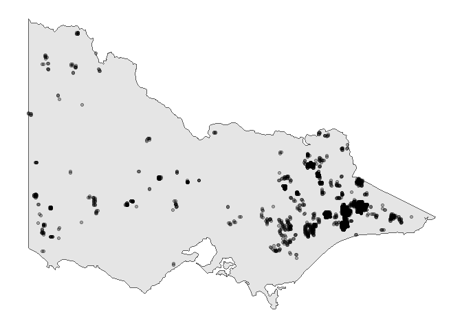

<!-- README.md is generated from README.Rmd. Please edit that file -->

# spotoroo

<!-- badges: start -->

[](https://github.com/TengMCing/spotoroo/actions)
[](https://codecov.io/gh/TengMCing/spotoroo?branch=master)
<!-- badges: end -->

spotoroo stands for spatiotemporal clustering in R of hot spot

## Installation

<!-- You can install the released version of spotoroo from [CRAN](https://CRAN.R-project.org) with: -->
<!-- ``` r -->
<!-- install.packages("spotoroo") -->
<!-- ``` -->

You can install the development version from
[GitHub](https://github.com/) with:

``` r
install.packages("devtools")
devtools::install_github("TengMCing/spotoroo")
```

## Example

This is a basic example which shows you how to solve a common problem:

``` r
library(spotoroo)
```

The built-in dataset `hotspots_fin`.

``` r
str(hotspots_fin)
#> 'data.frame':    1070 obs. of  3 variables:
#>  $ lon    : num  147 146 143 149 142 ...
#>  $ lat    : num  -37.5 -37.9 -37.8 -37.4 -37.1 ...
#>  $ obsTime: POSIXct, format: "2020-02-01 05:20:00" "2020-01-02 06:30:00" ...
```

``` r
hotspots_fin[1:10,]
#>       lon       lat             obsTime
#> 1  147.46 -37.46000 2020-02-01 05:20:00
#> 2  146.48 -37.93999 2020-01-02 06:30:00
#> 3  143.44 -37.82000 2020-01-03 07:20:00
#> 4  149.30 -37.36000 2020-01-22 05:10:00
#> 5  142.14 -37.06000 2020-01-18 06:40:00
#> 6  142.16 -37.50000 2020-01-03 05:40:00
#> 7  149.42 -37.34000 2020-01-26 04:40:00
#> 8  147.68 -36.62000 2020-01-04 05:10:00
#> 9  148.48 -37.40000 2020-01-15 05:20:00
#> 10 148.04 -36.38000 2020-01-12 08:50:00
```

``` r
library(tidyverse)
plot_vic_map() +
  geom_point(data = hotspots_fin, aes(lon, lat), alpha = 0.3) +
  ggtitle("Raw Hotspots")
```



Perform spatiotemporal clustering on this dataset. You need to provide
the data, here it is “hotspots\_fin”, specify which columns correspond
to the spatial variables (lon, lat), and which to time steps (obsTime).
There is a choice of options for the algorithm. “activeTime” sets the
time to consider that a fire can be active, and longer than this between
hotspots will create a new cluster. “adjDist” sets the maximum spatial
distance between hotspots beyond which they would be considered part of
a different cluster.

``` r
result <- hotspot_cluster(hotspots_fin,
                          lon = "lon",
                          lat = "lat",
                          obsTime = "obsTime",
                          activeTime = 24,
                          adjDist = 3000,
                          minPts = 4,
                          minTime = 3,
                          ignitionCenter = "mean",
                          timeUnit = "h",
                          timeStep = 1)
#> 
#> ------------------------------ SPOTOROO 0.0.0.9000 -----------------------------
#> 
#> -- Calling Core Function : `hotspot_cluster()` --
#> 
#> -- 1 time index = 1 hours
#> v Transform observed time > time indexes
#> i 970 time indexes found
#> 
#> -- activeTime = 24 time indexes | adjDist = 3000 meters
#> v Cluster
#> i 16 clusters found (including noise)
#> 
#> -- minPts = 4 hotspots | minTime = 3 time indexes
#> v Handle noise
#> i 6 clusters left
#> i noise proportion : 0.935 %
#> 
#> -- ignitionCenter = 'mean'
#> v Compute ignition points for clusters
#> i average hotspots : 176.7
#> i average duration : 131.9 hours
#> 
#> -- Time taken = 0 mins 4 secs for 1070 hotspots
#> i 0.003 secs per hotspot
#> 
#> --------------------------------------------------------------------------------
```

``` r
result
#> i spotoroo object: 6 clusters | 1070 hotspots
```

``` r
summary(result)
#> 
#> ------------------------------ SPOTOROO 0.0.0.9000 -----------------------------
#> 
#> -- Calling Core Function : `summary_spotoroo()` --
#> 
#> CLUSTERS: ALL
#> OBSERVATIONS: 1070
#> FROM: 2019-12-29 13:10:00
#> TO:   2020-02-07 22:50:00
#> 
#> -- Clusters
#> i Number of clusters: 6
#> 
#> Observations in cluster
#>         Min.     1st Qu.        Mean     3rd Qu.        Max.
#>        111.0       131.0       176.7       233.2       256.0
#> Duration of cluster (hours)
#>         Min.     1st Qu.        Mean     3rd Qu.        Max.
#>        111.2       118.2       131.9       146.1       148.3
#> 
#> -- Hotspots (excluding noise)
#> i Number of hotspots: 1060
#> 
#> Distance to ignition points (m)
#>         Min.     1st Qu.        Mean     3rd Qu.        Max.
#>          0.0      2840.3      5058.2      6981.6     13452.7
#> Time from ignition (hours)
#>         Min.     1st Qu.        Mean     3rd Qu.        Max.
#>          0.0        25.2        62.5        98.2       148.3
#> 
#> -- Noise
#> i Number of noise points: 10 (0.93 %)
#> 
#> --------------------------------------------------------------------------------
```

Extract fires

``` r
extract_fire(result, 1:2)[1:10,]
#>       lon       lat             obsTime timeID membership noise distToIgnition
#> 1  149.30 -37.75999 2019-12-29 13:10:00      1          1 FALSE       1111.885
#> 2  149.30 -37.78000 2019-12-29 13:10:00      1          1 FALSE       1111.885
#> 3  149.32 -37.78000 2019-12-29 13:30:00      1          1 FALSE       2080.914
#> 4  149.30 -37.75999 2019-12-29 14:50:00      2          1 FALSE       1111.885
#> 5  149.30 -37.78000 2019-12-29 14:50:00      2          1 FALSE       1111.885
#> 6  149.32 -37.78000 2019-12-29 14:50:00      2          1 FALSE       2080.914
#> 7  149.30 -37.75999 2019-12-29 15:00:00      2          1 FALSE       1111.885
#> 8  149.30 -37.78000 2019-12-29 15:00:00      2          1 FALSE       1111.885
#> 9  149.32 -37.78000 2019-12-29 15:00:00      2          1 FALSE       2080.914
#> 10 149.28 -37.80000 2019-12-29 16:00:00      3          1 FALSE       3768.797
#>    distToIgnitionUnit timeFromIgnition timeFromIgnitionUnit    type
#> 1                   m  0.0000000 hours                    h hotspot
#> 2                   m  0.0000000 hours                    h hotspot
#> 3                   m  0.3333333 hours                    h hotspot
#> 4                   m  1.6666667 hours                    h hotspot
#> 5                   m  1.6666667 hours                    h hotspot
#> 6                   m  1.6666667 hours                    h hotspot
#> 7                   m  1.8333333 hours                    h hotspot
#> 8                   m  1.8333333 hours                    h hotspot
#> 9                   m  1.8333333 hours                    h hotspot
#> 10                  m  2.8333333 hours                    h hotspot
#>    obsInCluster clusterTimeLen clusterTimeLenUnit
#> 1           146 116.1667 hours                  h
#> 2           146 116.1667 hours                  h
#> 3           146 116.1667 hours                  h
#> 4           146 116.1667 hours                  h
#> 5           146 116.1667 hours                  h
#> 6           146 116.1667 hours                  h
#> 7           146 116.1667 hours                  h
#> 8           146 116.1667 hours                  h
#> 9           146 116.1667 hours                  h
#> 10          146 116.1667 hours                  h
```

Plot of the result. In this example, there is a total of 6 clusters, so
all can be displayed.

``` r
plot(result, bg = vic_map)
```


You can also choose a subset of clusters, and this will plot withou a
map, so that you can see a zoomed in view of the hotspot clusters and
their ignition points.

``` r
plot(result, cluster = c(1,2,3,4))
```


To examine the fire movements, use the option “mov”, and the movement
will be shown as connected lines between centroids at each time step,
for each cluster.

``` r
plot(result,
     type = "mov",
     cluster = 1:6,
     step = 3,
     hotspot = TRUE,
     bg = vic_map)
```


To examine the time line of clusters, to learn about intensity of fire
periods use the option “timeline”.

``` r
plot(result, "timeline", 
     dateLabel = "%b %d", 
     mainBreak = "1 week")
```


