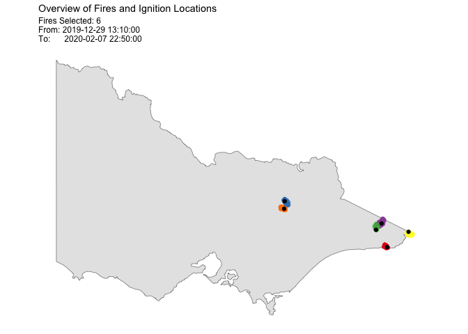

<!-- README.md is generated from README.Rmd. Please edit that file -->

# spotoroo

<!-- badges: start -->

<!-- badges: end -->

The goal of spotoroo is to …

## Installation

<!-- You can install the released version of spotoroo from [CRAN](https://CRAN.R-project.org) with: -->

<!-- ``` r -->

<!-- install.packages("spotoroo") -->

<!-- ``` -->

You can install the development version from
[GitHub](https://github.com/) with:

``` r
install.packages("devtools")
devtools::install_github("TengMCing/spotoroo")
```

## Example

This is a basic example which shows you how to solve a common problem:

``` r
library(spotoroo)
```

The built-in dataset `hotspots_fin`.

``` r
str(hotspots_fin)
#> 'data.frame':    1070 obs. of  3 variables:
#>  $ lon    : num  147 146 143 149 142 ...
#>  $ lat    : num  -37.5 -37.9 -37.8 -37.4 -37.1 ...
#>  $ obsTime: POSIXct, format: "2020-02-01 05:20:00" "2020-01-02 06:30:00" ...
```

``` r
hotspots_fin[1:10,]
#>       lon       lat             obsTime
#> 1  147.46 -37.46000 2020-02-01 05:20:00
#> 2  146.48 -37.93999 2020-01-02 06:30:00
#> 3  143.44 -37.82000 2020-01-03 07:20:00
#> 4  149.30 -37.36000 2020-01-22 05:10:00
#> 5  142.14 -37.06000 2020-01-18 06:40:00
#> 6  142.16 -37.50000 2020-01-03 05:40:00
#> 7  149.42 -37.34000 2020-01-26 04:40:00
#> 8  147.68 -36.62000 2020-01-04 05:10:00
#> 9  148.48 -37.40000 2020-01-15 05:20:00
#> 10 148.04 -36.38000 2020-01-12 08:50:00
```

``` r
library(tidyverse)
ggplot(hotspots_fin) +
  geom_sf(data = vic_map) +
  geom_point(aes(lon, lat), alpha = 0.3) +
  ggthemes::theme_map() +
  ggtitle("Raw Hotspots")
```



Perform spatiotemporal clustering on this dataset.

``` r
result <- hotspot_cluster(hotspots_fin,
                          lon = "lon",
                          lat = "lat",
                          obsTime = "obsTime",
                          activeTime = 24,
                          adjDist = 3000,
                          minPts = 4,
                          minTime = 3,
                          ignitionCenter = "mean",
                          timeUnit = "h",
                          timeStep = 1)
#> 
#> ------------------------------ SPOTOROO 0.0.0.9000 -----------------------------
#> 
#> -- Calling Core Function : `hotspot_cluster()` --
#> 
#> -- 1 time index = 1 hours
#> v Transform observed time > time indexes
#> i 970 time indexes found
#> 
#> -- activeTime = 24 time indexes | adjDist = 3000 meters
#> v Cluster
#> i 16 clusters found (including noise)
#> 
#> -- minPts = 4 | minTime = 3
#> v Handle noise
#> i 6 clusters left
#> i noise proportion : 0.934579439252336 %
#> 
#> -- ignitionCenter = 'mean'
#> v Compute ignition points for clusters
#> i average hotspots : 176.7
#> i average duration : 131.9 hours
#> 
#> -- Time taken = 0 mins 5 secs for 1070 hotspots
#> i 0.005 secs per hotspot
#> 
#> --------------------------------------------------------------------------------
```

The ignition points of the bushfires.

``` r
result$ignition
#>   membership      lon       lat             obsTime timeID obsInCluster
#> 1          1 149.3000 -37.77000 2019-12-29 13:10:00      1          146
#> 2          2 146.7200 -36.84000 2020-01-08 01:40:00    229          165
#> 3          3 149.0200 -37.42000 2020-01-09 06:10:00    258          126
#> 4          4 149.1600 -37.29000 2020-01-10 04:10:00    280          256
#> 5          5 146.7067 -36.99333 2020-01-12 04:00:00    327          111
#> 6          6 149.8400 -37.46000 2020-02-03 07:40:00    859          256
#>   clusterTimeLen clusterTimeLenUnit
#> 1 116.1667 hours                  h
#> 2 148.3333 hours                  h
#> 3 146.3333 hours                  h
#> 4 124.1667 hours                  h
#> 5 145.3333 hours                  h
#> 6 111.1667 hours                  h
```

The memberships of the first 10 hotspots.

``` r
result$hotspots[1:10,]
#>       lon       lat             obsTime timeID membership noise distToIgnition
#> 1  147.46 -37.46000 2020-02-01 05:20:00    809         -1  TRUE              0
#> 2  146.48 -37.93999 2020-01-02 06:30:00     90         -1  TRUE              0
#> 3  143.44 -37.82000 2020-01-03 07:20:00    115         -1  TRUE              0
#> 4  149.30 -37.36000 2020-01-22 05:10:00    569         -1  TRUE              0
#> 5  142.14 -37.06000 2020-01-18 06:40:00    474         -1  TRUE              0
#> 6  142.16 -37.50000 2020-01-03 05:40:00    113         -1  TRUE              0
#> 7  149.42 -37.34000 2020-01-26 04:40:00    664         -1  TRUE              0
#> 8  147.68 -36.62000 2020-01-04 05:10:00    137         -1  TRUE              0
#> 9  148.48 -37.40000 2020-01-15 05:20:00    401         -1  TRUE              0
#> 10 148.04 -36.38000 2020-01-12 08:50:00    332         -1  TRUE              0
#>    distToIgnitionUnit timeFromIgnition timeFromIgnitionUnit
#> 1                   m   718.8333 hours                    h
#> 2                   m   718.8333 hours                    h
#> 3                   m   718.8333 hours                    h
#> 4                   m   718.8333 hours                    h
#> 5                   m   718.8333 hours                    h
#> 6                   m   718.8333 hours                    h
#> 7                   m   718.8333 hours                    h
#> 8                   m   718.8333 hours                    h
#> 9                   m   718.8333 hours                    h
#> 10                  m   718.8333 hours                    h
```

<!-- Summary of the clustering result. -->

<!-- ```{r} -->

<!-- summary(results) -->

<!-- ``` -->

Plot of the result.

``` r
plot(result, bg = plot_vic_map())
```


``` r
plot(result, cluster = c(1,2,3,4))
```


``` r
plot(result,
     type = "mov",
     cluster = 1:6,
     step = 6,
     hotspot = TRUE,
     bg = plot_vic_map())
```


``` r
plot(result, "timeline", 
     dateLabel = "%b %d", 
     mainBreak = "1 week", 
     minorBreak = "1 day")
```


