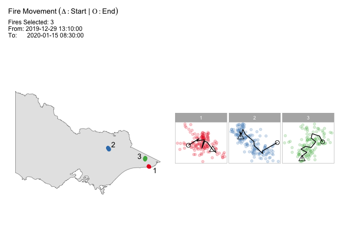

<!-- README.md is generated from README.Rmd. Please edit that file -->

# hotspotcluster

<!-- badges: start -->

<!-- badges: end -->

The goal of hotspotcluster is to …

## Installation

<!-- You can install the released version of hotspotcluster from [CRAN](https://CRAN.R-project.org) with: -->

<!-- ``` r -->

<!-- install.packages("hotspotcluster") -->

<!-- ``` -->

You can install the development version from
[GitHub](https://github.com/) with:

``` r
install.packages("devtools")
devtools::install_github("TengMCing/hotspotcluster")
```

## Example

This is a basic example which shows you how to solve a common problem:

The built-in dataset `hotspots5000`.

``` r
library(hotspotcluster)
str(hotspots5000)
#> 'data.frame':    5000 obs. of  4 variables:
#>  $ id     : int  1 2 3 4 5 6 7 8 9 10 ...
#>  $ lon    : num  141 141 141 141 141 ...
#>  $ lat    : num  -37.1 -37.1 -37.1 -37.1 -37.1 ...
#>  $ obstime: POSIXct, format: "2019-10-01 03:20:00" "2019-10-01 03:20:00" ...
```

``` r
hotspots5000[1:10,]
#>    id    lon    lat             obstime
#> 1   1 141.12 -37.10 2019-10-01 03:20:00
#> 2   2 141.14 -37.10 2019-10-01 03:20:00
#> 3   3 141.12 -37.12 2019-10-01 03:20:00
#> 4   4 141.14 -37.12 2019-10-01 03:20:00
#> 5   5 141.16 -37.12 2019-10-01 03:20:00
#> 6   6 141.12 -37.14 2019-10-01 03:20:00
#> 7   7 141.14 -37.14 2019-10-01 03:20:00
#> 8   8 141.16 -37.14 2019-10-01 03:20:00
#> 9   9 141.12 -37.16 2019-10-01 03:20:00
#> 10 10 141.14 -37.16 2019-10-01 03:20:00
```


Perform spatiotemporal clustering on this dataset.

``` r
results <- hotspot_cluster(hotspots5000, 
                           lon = "lon", 
                           lat = "lat", 
                           obstime = "obstime",
                           ActiveTime = 24,
                           AdjDist = 3000,
                           ignition_center = "mean",
                           time_unit = "hours",
                           timestep = 1)
#> Transform time_id <U+2713> 
#> Clustering <U+2713> 
#> Compute ignition points <U+2713> 
#> Number of clusters: 217
#> Time taken: 0 mins 28 secs for 5000 obs (0.006 secs/obs)
```

The ignition points of the first 10 bushfires.

``` r
results$ignitions[1:10,]
#>    ignition_lon ignition_lat    ignition_obstime
#> 1       141.136    -37.13000 2019-10-01 03:20:00
#> 2       141.300    -37.65000 2019-10-01 04:30:00
#> 3       141.480    -37.34000 2019-10-02 03:00:00
#> 4       147.160    -37.85000 2019-10-02 04:40:00
#> 5       148.120    -37.57999 2019-10-02 04:50:00
#> 6       144.180    -38.35000 2019-10-02 06:10:00
#> 7       143.580    -36.15000 2019-10-02 23:00:00
#> 8       143.140    -37.25999 2019-10-03 01:00:00
#> 9       141.150    -36.54000 2019-10-03 04:30:00
#> 10      143.360    -37.32000 2019-10-03 06:00:00
```

The memberships of the first 10 hotspots.

``` r
results$hotspots[1:10,]
#>       lon    lat             obstime memberships
#> 1  141.12 -37.10 2019-10-01 03:20:00           1
#> 2  141.14 -37.10 2019-10-01 03:20:00           1
#> 3  141.12 -37.12 2019-10-01 03:20:00           1
#> 4  141.14 -37.12 2019-10-01 03:20:00           1
#> 5  141.16 -37.12 2019-10-01 03:20:00           1
#> 6  141.12 -37.14 2019-10-01 03:20:00           1
#> 7  141.14 -37.14 2019-10-01 03:20:00           1
#> 8  141.16 -37.14 2019-10-01 03:20:00           1
#> 9  141.12 -37.16 2019-10-01 03:20:00           1
#> 10 141.14 -37.16 2019-10-01 03:20:00           1
```


